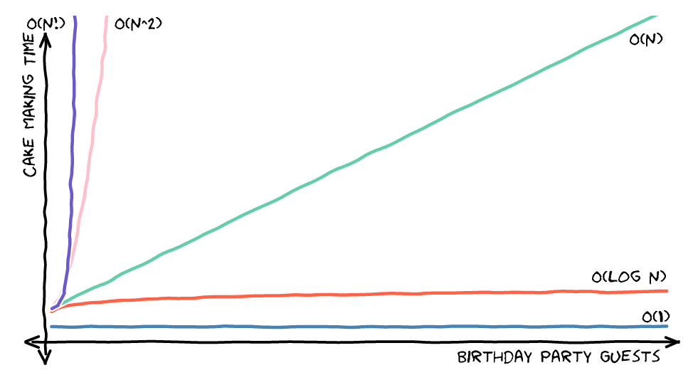

# [数据结构](data_struct.md)
- 基础数据结构：数组、链表、队列、栈、散列等
- [树](trees.md)
- [堆](heap.md)
- [图](graph.md)

# 算法
算法实际分两大类，即排序算法和搜索算法；递归、迭代、分治等是算法的实现思路。

## [算法思路](base_algo.md)
- 递归
- 分治算法
- 贪婪算法
- 动态规划
- 回溯法

## [排序(sort)算法](sort.md)

## [搜索(search)算法](search.md)
*中文可以叫搜索算法或查找算法，英文只有Search algorithm，没有Find algorithm。即使常说的“二分查找”，英文也是Binary Search。*

#### 基础搜索算法
Wikipedia的“Search algorithm”词条：
> Search algorithms can be classified based on their mechanism of searching into 3 types of algorithms: linear, binary, and hashing

- 简单查找
- 二分查找：也称对数搜索(logarithmic search)，是一种在有序数组中查找某一特定元素的搜索算法。 ...如果在某一步骤数组为空，则代表找不到。
- Hash查找
#### 树和图的搜索
- 深度优先搜索(BFS)
- 广度优先搜索(DFS)

## 算法性能(大O表示法)
#### 常见的算法性能
  
（汇总图综合文献1和2，注意文献2中的竖坐标有压缩）

- 常数时间 O(1)
- 对数时间 O(logn)
- 线性时间 O(n)

解释见文献1；
#### 大O的意义
数学上使用希腊字母表示函数式关系，大O表示函数式上边界；  
即，大O表示法描述算法性能时，O(x)表示算法的最差性能是x；

希腊字母意义，详见文献2
- Big O (O()) describes the upper bound of the complexity.
- Omega (Ω()) describes the lower bound of the complexity.
- Theta (Θ()) describes the exact bound of the complexity.
- Little O (o()) describes the upper bound excluding the exact bound.

## 参考文档
1. [图解大 O 表示法](https://chinese.freecodecamp.org/news/big-o-notation/)
2. [What is Big O Notation Explained: Space and Time Complexity](https://www.freecodecamp.org/news/big-o-notation-why-it-matters-and-why-it-doesnt-1674cfa8a23c/)
3. [**OI Wiki**:编程竞赛 (competitive programming) 知识整合站点](https://oi-wiki.org/basic/) (数据结构与算法在线知识学习首推)
4. [C++ Data Structures and Algorithms Cheat Sheet](https://github.com/gibsjose/cpp-cheat-sheet/blob/master/Data%20Structures%20and%20Algorithms.md)
5. [算法可视](https://algorithm-visualizer.org)
6. [可视化算法](https://visualgo.net/en)

# 常见面试题
1. 查找性能的比较？ 
   - 简单查找：线性时间；
   - 二分查找：对数时间；
   - 散列表：常量时间；
2. xx
