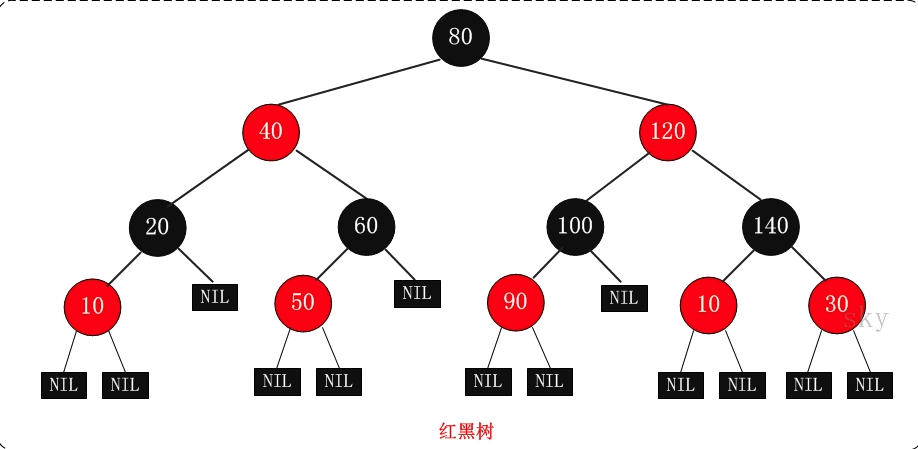

## 二叉树

#### 二叉排序树(BST)
二叉排序树T是一棵二叉树，或者为空，或者满足下面条件：
1. 若T的根结点的左子树非空，则**左子树中所有结点的值均小于根节点值**；
2. 若T的根结点的右子树非空，则**右子树中所有结点的值均大于根节点值**；
3. T的左右子树也分别为二叉排序树。

#### 哈夫曼树(Huffman Tree)
哈夫曼树又称最优二叉树，是一种带权路径长度最短的二叉树。所谓树的带权路径长度，就是树中所有的叶结点的权值乘上其到根结点的路径长度（若根结点为0层，叶结点到根结点的路径长度为叶结点的层数）。  
树的路径长度是从树根到每一结点的路径长度之和，记为WPL=（W1*L1+W2*L2+W3*L3+...+Wn*Ln），N个权值Wi（i=1,2,...n）构成一棵有N个叶结点的二叉树，相应的叶结点的路径长度为Li（i=1,2,...n）。可以证明哈夫曼树的WPL是最小的。

## 字典树

## 线段树

## 红黑树
* 是一种特殊的二叉查找树，意味着它满足二叉查找树的特征：任意一个节点所包含的键值，大于等于左孩子的键值，小于等于右孩子的键值。
* 它是自平衡的二叉查找树，在进行插入和删除等可能会破坏树的平衡的操作时，需要重新自处理达到平衡状态。

#### 红黑树的特性
1. 每个节点要么是黑色，要么是红色。
2. 根节点是黑色。
3. 每个叶子节点(NIL)是黑色。 [注意：这里叶子节点，是指为空的叶子节点！]
4. 每个红色节点的两个子节点一定都是黑色。
5. **任意一节点到每个叶子节点的路径都包含数量相同的黑节点**。

从特性5可以推出：
如果一个节点存在黑子节点，那么该节点肯定有两个子节点。

#### 红黑树的应用
主要是用它来存储有序的数据，它的时间复杂度是O(lgn)，效率非常之高。
例如，C++ STL中的set、map，以及Linux虚拟内存的管理，都是通过红黑树实现的。

#### 参考文档
1. [30张图带你彻底理解红黑树](https://www.jianshu.com/p/e136ec79235c)
2. [红黑树(一)之 原理和算法详细介绍](https://www.cnblogs.com/skywang12345/p/3245399.html)
3. [数据结构和算法——Huffman树和Huffman编码](https://blog.csdn.net/google19890102/article/details/54848262)
