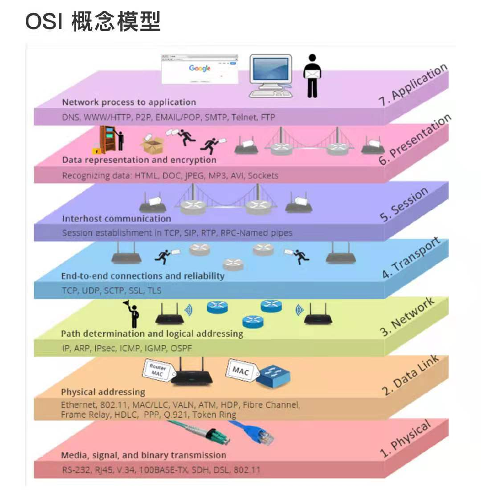

# 网络及协议

## 基本概念

### OSI网络模型

### Bridging(桥接)
##### .1D Bridging(桥接)
IEEE 802.1D提出MAC bridge标准，**桥接(Ethernet bridging)是基于MAC地址的二层(数据链路层)转发**，基本操作含：  
- 泛洪(Flooding)：是交换机和网桥使用的一种数据流传递技术，将某个接口收到的数据流从除该接口之外的所有接口发送出去。[泛洪和广播的区别](https://blog.51cto.com/tingfeng/795612)：泛洪操作广播的是普通数据帧而不是广播帧。
- 转发(Forwarding)
- 学习(Learning)

##### .1Q VLAN
IEEE 802.1Q在.1D的基础上扩展，引入VLAN；VLAN对物理以太网做了逻辑划分：
- 报文仅在单个VLAN内桥接；
- 带有未知DA或广播DA的报文仅在VLAN内泛洪；

##### .1P priority
IEEE 802.1P在.1Q的基础上扩展，引入“priority tagged”，仅传输优先级、不传输VID；  

### Switching(交换)

### Routing(路由)

# 网络技术

### 弹性hash(Resilient Hashing)
LAG、ECMP中用于避免新增或删除成员时已有链路的变化。  
Broadcom、Juniper都有实现类似功能。Juniper可能是基于BRCM SDK的实现。  
[Juniper: Resilient Hashing on LAGs and ECMP groups](https://www.juniper.net/documentation/us/en/software/junos/interfaces-ethernet-switches/topics/topic-map/switches-interface-resilient-hashing.html)

# [网络技术洞察](insights.md)

## 参考
1. [SRv6官网？](https://www.segment-routing.net/)
2. socket收发机制：[动图图解！代码执行 send 成功后，数据就发出去了吗？](https://mp.weixin.qq.com/s/cLiUuakA9kYReKHzn86zpQ)
