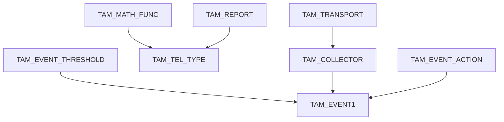
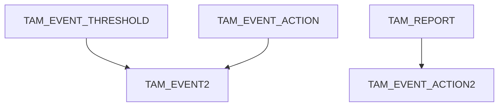

# 基本概念

Telementry、INT、DTEL、TAM的区别？
- Telementry：运维标准？
- INT：Inband Network Telemetry，
- DTEL：Data Plane Telemetry，SAI提出？
- TAM：SAI Telemetry and Monitoring (TAM)，SAI提出；

# TAM
[SAI-Proposal-TAM2.0-v2.0.docx](https://github.com/opencomputeproject/SAI/tree/master/doc/TAM)

## 数据模型
#### 数据获取模型
- Push：发布(publish)/订阅(subscribe)机制；
- Pull：仍存在通过pull立即显示数据的需求。SAI提供一个API支持多种不同的数据。

```c
/**
 * @brief TAM telemetry data get API
 *
 * @param[in] switch_id SAI Switch object id
 * @param[in] obj_list SAI Switch object list
 * @param[in] clear_on_read Flag to clear the read data
 * @param[inout] buffer_size Actual buffer size in bytes
 * @param[out] buffer Data buffer
 *
 * @return #SAI_STATUS_SUCCESS on success, failure status code on error
 */
sai_status_t sai_tam_telemetry_get_data(
        _In_ sai_object_id_t switch_id,
        _In_ sai_object_list_t obj_list,
        _In_ bool clear_on_read,
        _Inout_ sai_size_t *buffer_size,
        _Out_ void *buffer);
```

#### 数据订阅粒度
> SAI driver will provide data at a coarse granularity and NOS will be responsible for discarding data or keeping a local cache. 
> This is in fact a better choice as NOS can keep a local copy for low frequency updated data.

#### TAM对象
SAI提供的API均是按TAM各层次对象粒度的，各层次间对象关系见3.2节。   

示例
一个TAM对象中包含多个event和telementry对象时：
- Flow stats: 流统计
- Event1：丢包超比例触发事件；生成simple report；
- Event2：队列超阈值触发事件；生成histogram report；
TAM对象附加到独立的port、vlan或队列上。


Event1构造


Event2构造



不同对象之间是聚合关系，创建时绑定。  
SAI TAM文档第10章示例中给出的对象聚合：TAM_MATH_FUNC对象聚合到TAM_TEL_TYPE对象中，TAM_TEL_TYPE对象又聚合到TAM_TELEMETRY对象。  
对象、聚合最大程度实现了模块复用，如10.1.3复用了collector和report对象、10.1.4复用了collector对象。  
```c
/* Step 1: Create a math function
* ---------------------------------------- */
/* create math function for rate computation */
sai_attr_list[0].id = SAI_TAM_MATH_FUNC_ATTR_TAM_TEL_MATH_FUNC_TYPE;
sai_attr_list[0].value.s32 = SAI_TAM_TEL_MATH_FUNC_TYPE_RATE;

attr_count = 1;
sai_create_tam_math_func_fn(&sai_tam_math_func_obj,  // TAM_MATH_FUNC对象创建
                            switch_id,
                            attr_count,
                            sai_attr_list);

/* Step 2: Create a flow telemetry type object
* ---------------------------------------- */
sai_attr_list[0].id = SAI_TAM_TEL_TYPE_ATTR_TAM_TELEMETRY_TYPE;
sai_attr_list[0].value.s32 = SAI_TAM_TELEMETRY_TYPE_FLOW;

sai_attr_list[1].id = SAI_TAM_TEL_TYPE_ATTR_FLOW_ID;
sai_attr_list[1].value.u32 = 0x12345678;

sai_attr_list[2].id = SAI_TAM_TEL_TYPE_ATTR_MATH_FUNC;
sai_attr_list[2].value.oid = sai_tam_math_func_obj;   // TAM_MATH_FUNC对象聚合到TAM_TEL_TYPE对象

sai_attr_list[3].id = SAI_TAM_TEL_TYPE_ATTR_REPORT_ID;
sai_attr_list[3].value.oid = sai_tam_report_obj; /* Report object created earlier and reused */

attr_count = 3;
sai_create_tam_tel_type_fn(&sai_tam_flow_tel_type_obj,  // TAM_TEL_TYPE对象创建
                           switch_id,
                           attr_count,
                           sai_attr_list);

/* Step 3: Create telemetry object
* ---------------------------------------- */
sai_attr_list[0].id = SAI_TAM_TELEMETRY_ATTR_TAM_TYPE_LIST;
sai_attr_list[0].value.objlist.count = 1;
sai_attr_list[0].value.objlist.list[0] = sai_tam_flow_tel_type_obj;  // TAM_TEL_TYPE对象聚合到TAM_TELEMETRY

sai_attr_list[1].id = SAI_TAM_TELEMETRY_ATTR_COLLECTOR_LIST;
sai_attr_list[1].value.objlist.count = 1;
sai_attr_list[1].value.objlist.list[0] = sai_tam_collector_obj; /* Collector object created earlier and reused */

attr_count = 2;
sai_create_tam_telemetry_fn(&sai_tam_telemetry_obj,  // TAM_TELEMETRY对象创建
                            switch_id,
                            attr_count,
                            sai_attr_list);
```

#### 对象绑定
数据由switch中的data source生成；TAM对象需绑定到数据源上。
两种绑定方式：
- 源绑定(Source binding)：源的属性中指定TAM对象；
- 对象绑定(Object binding)：TAM对象自身包含源列表；  

首选方式1的提示机制。

#### 数据模型及序列化/反序列化(Serialization/De-serialization)
##### GPB(Google Protocol Buffer)
- [ProtoBuf开源地址](https://github.com/protocolbuffers/protobuf/releases)
- [ProtoBuf开发指南](https://developers.google.com/protocol-buffers/docs/proto)

GPB文件，.proto后缀的文件。  

## 配置
#### 如何新增数据属性

#### 如何新增Event

#### INT(Inband Network Telemetry)配置
INT是逐包逐流的数据收集。基于包的数据收集有两种构造形式：
- 插入metadata识别报文；
- 插入metadata和metadata头；

设备主要执行三种操作
- 初始化：创建监测报文的flow group。
- 发送：基于IFA/IOAM/Extn配置识别报文，给识别出的报文插入metadata；
- 终结：终结带metadata的报文。


# Data Plane Telemetry (DTEL)
[源文档](https://github.com/opencomputeproject/SAI/blob/master/doc/DTEL/SAI-Proposal-Data-Plane-Telemetry.md)

