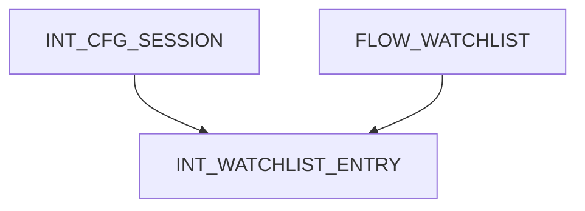
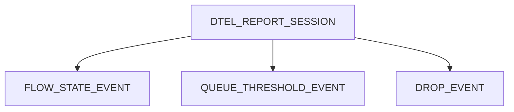

# Data Plane Telemetry (DTEL)基本概念
DTEL由以下三部分组成(三个部分可以不局限在一台switch中)：
- Watchlist：识别流量(Which flow to monitor)，一般使用SAI ACL实现，TCAM匹配报文头域段、端口等，AD指定telemetry动作；
- Event detection：事件监测，可监测三类事件：flow events、packet drop events、queue congestion events；
- Telemetry report：由监测事件触发，switch生成给monitor的telemetry报告，报告消息包含报文头和报文关联的switch metadata(如时间戳、上/下行端口、队列深度/时延)；

### DTEL的telemetry报告
- Flow Report
  - In-band Telemetry：转发路径上的节点switch设备添加各自的metadata到telemetry头中，报文从source节点、经过transit节点，到sink节点；sink节点提取telemetry信息，转换为telemetry报告后给Monitor；
  - Packet Postcard：每个switch设备自行判决，并独立地将报文上报到monitor；Postcard方式无需改报文(不需要插入metadata)；
- Drop report：switch将上行pipe、下行pipe或交换网fabric的丢包信息发到monitor，信息包含原始报文头、switch metadata和Drop reason；
- Queue Report：可配置指定队列上报拥塞或尾丢弃消息；根据队列深度或时延阈值判断是否拥塞。   

**DTEL的queue report可以作为TAM snapshot的互补**：
- TAM snapshot在超阈值时上报成块的队列统计数据；
- DTEL的queue report可以基于每个报文在拥塞开始时发送消息，以便monitor能看到队列构造的逐包信息。

### 示例

##### 对象功能
|对象|功能描述|成员举例|
|--|--|--|
|DTEL|DTEL对象属性|含绑定的switchID，endpoint使能，sink节点端口号等|
|REPORT_SESSION|消息上报会话属性，主要含monitor目的地址|含monitor的IP、端口号、上报消息截断字节数等|
|EVENT|指定监测事件的类型|含flow、queue和drop三种event类型|
|QUEUE_REPORT|队列上报时的队列属性|含队列ID、时延阈值、是否尾丢弃等|
|INT|flow上报时，INT配置属性|含INT会话最大跳数、INT头收集哪些信息等|
|WatchList|无专用对象，直接使用ACL table和ACL entry创建watchlist|||

##### WatchList创建

##### Event创建

##### DTEL对象创建
使能endpoint  
设置sink端口  

## 参考
1. [SAI-Proposal-Data-Plane-Telemetry.md](https://github.com/opencomputeproject/SAI/blob/master/doc/DTEL/SAI-Proposal-Data-Plane-Telemetry.md)
2. [Data-Plane-Telemetry-ONF-Connect-Public.pdf](https://opennetworking.org/wp-content/uploads/2018/12/Data-Plane-Telemetry-ONF-Connect-Public.pdf)
