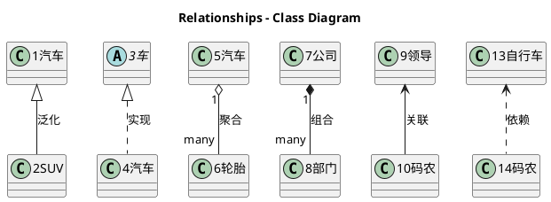

# UML图类型

## 类图

### 类间关系

|关系|UML符号|说明|逻辑表示|[代码实现](relation.md)|
|--|--|--|--|--|
|**泛化**(Generalization)|实线+空心箭头|就是面向对象语言中的**继承**(Inheritance)关系(部分文档直接叫继承)|is a|子类继承父类|
|**实现**(Realization)|虚线+空心箭头|和“泛化”相似，区别在于“实现”继承一个抽象类（abstract、interface），而“泛化”关系继承一个具体类。|is a|**实现接口**或继承某个抽象类|
|聚合(Aggregation)|实线+空心菱形|是整体与部分的关系，部分能脱离整体而独立存在，生命周期不绑定。也称委托关系|has a /many|成员变量|
|**组合**(Composition)|实线+实心菱形|是整体与部分的关系，但部分不能脱离整体而独立存在，生命周期绑定。|has a /many|成员变量|
|关联(Association)|实线+箭头|关联的两个对象之间是平等的，不强调整体与部分，是一种非常弱的关系。如你是我的朋友，或学生和老师的关系|has a /many|成员变量|
|**依赖**(Dependency)|虚线+箭头|对象之间是临时关系(或使用关系)，临时性体现在不超越方法的周期。在方法使用到的，如参数类，就一定是依赖关系。尽量不使用双向依赖|use a|局部变量、方法的参数和静态方法的调用|

六种关系的耦合度大小是：泛化 = 实现 > 组合 > 聚合 > 关联 > 依赖  

#### 类的派生和继承关系

类的派生和继承是面向对象程序设计方法和C++语言最重要的特征之一。

> “黑狗就是毛是黑色的狗/黑毛狗”是从一般的dog类通过特殊化而得到类blackDog的。这种通过特殊化已有的类来建立新类的过程，叫做“类的派生”，原有的类叫做“基类”，新建立的类则叫做“派生类”。

> 另一方面，从类的成员的角度来看，派生类自动地将基类地所有成员作为自己的成员，这叫做“继承”。基类和派生类又可以分别叫做“父类”和“子类”，有时也成为“一般类”和“特殊类”。

在C++中，派生（Derive）和继承(inheritance)是一个概念，只是站的角度不同。继承是儿子接收父亲的产业，派生是父亲把产业传承给儿子。

被继承的类称为父类或基类，继承的类称为子类或派生类。“子类”和“父类”通常放在一起称呼，“基类”和“派生类”通常放在一起称呼。

#### 组合、聚合和关联的区别
- “关联”的两个对象是**平等关系**，“聚合”、“组合”是**整体和部分的关系**；
- “聚合”整体和部分**生命周期不同**，“组合”的**整体和部分不可分**、生命周期相同；(见文档2)  
> 在组合(Composition)关系中，整体与部分是不可分的，整体的生命周期结束也就意味着部分的生命周期结束。

> 聚合(Aggregation)的整体和部分之间在生命周期上没有什么必然的联系，部分对象可以在整体对象创建之前创建，也可以在整体对象销毁之后销毁。

> 简单的可以认为，如果一个类作为了另外一个类的属性，那一定是关联关系。但你要知道，聚合是一种特殊的关联，而组合又是一种特殊的聚合。一般的关联我们认为是平级的、无整体部分关系的，如朋友关系。

#### 依赖关系的三种实现方式
- 将一个类的对象作为另一个类中方法的参数
- 在一个类的方法中将另一个类的对象作为其对象的局部变量
- 在一个类的方法中调用另一个类的静态方法

#### 总结
六种关系实际可概括为三种：
- 泛化、实现的is a关系；
- 组合、聚合、关联的has a或has many关系；
- 依赖的use a关系；  

<设计模式之美 by 王争>中使用四种记忆：
> 只保留了四个关系：泛化、实现、组合、依赖，这样你掌握起来会更加容易。  
其中，泛化、实现、依赖的定义不变，组合关系替代UML中组合、聚合、关联三个概念，也就相当于重新命名关联关系为组合关系，并且不再区分UML中的组合和聚合两个概念。之所以这样重新命名，是为了跟我们前面讲的“多用组合少用继承”设计原则中的“组合”统一含义。只要B类对象是A类对象的成员变量，那我们就称，A类跟B类是组合关系。

## 时序图

## 状态图

# UML工具

PlantUML和Mermaid都支持以“代码”的方式绘制UML图，含类图、时序图、状态图等。两者语法不完全相同。  
- 前者尚未在github上支持嵌入，需引用外链；但其图形标识好于后者，比如类有“C”标识。  
- 后者已支持github嵌入，但图形标识过于简单，尤其是类图标识主观感受较差。   
不强依赖github的话，建议还是使用plantUML。

### PlantUML

PlantUML在github上只能使用外链，没法直接使用内嵌语法(实际markdown支持内嵌，但github未支持？)。

github上的markdwon内嵌plantuml方法，使用PlantUML官网的Online Server存储UML，github中引用存储的外链。  
本地使用时，推荐VScode中安装PlantUML插件。

### Mermaid

Mermaid已支持github上直接使用markdown内嵌，如：

# 参考文档
1. [UML中类之间的六大关系](https://blog.csdn.net/ruren1/article/details/81584232?utm_medium=distribute.pc_relevant.none-task-blog-2%7Edefault%7EBlogCommendFromMachineLearnPai2%7Edefault-1.control&depth_1-utm_source=distribute.pc_relevant.none-task-blog-2%7Edefault%7EBlogCommendFromMachineLearnPai2%7Edefault-1.control)
2. [关联、聚合、组合的区别](https://zhuanlan.zhihu.com/p/359672087)
3. [UML类图的箭头含义](https://www.jianshu.com/p/8969ab8c48c7)
4. [C++继承和派生简明教程](http://c.biancheng.net/view/2264.html)
5. [C++ UML关系总结](https://www.daimajiaoliu.com/daima/47192348b900403)
6. [PlantUML官网](https://plantuml.com/zh/)：PlantUML语法介绍及Online Server
7. [PlantText](https://www.planttext.com/)：UML在线绘制
8. [Mermaid在线绘图](https://mermaid-js.github.io/mermaid-live-editor/)
9. [Mermaid官网](https://mermaid-js.github.io/mermaid/#/)

----

附：plantUML类图关系源码（github上暂无法直接渲染显示）  

PlantUML类间关系绘制，如组合聚合一对多关系(见文档6的类图示例)   

