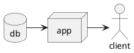

# UML

### UML图分类

##### 时序图

##### 状态图

##### 类图

### 工具

##### PlantUML

[PlantUML在线绘制](https://plantuml.com/zh/)
支持github上的markdwon内嵌plantuml解析，示例：

```plantuml
@startuml component
actor client
node app
database db

db -> app
app -> client
@enduml
```

### 参考文档

