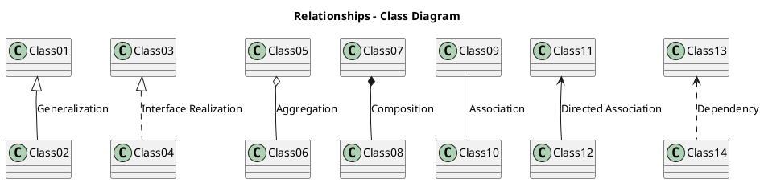

# UML

## UML图分类

### 时序图

### 状态图

### 类图
[UML类图中的6大关系](https://blog.csdn.net/ruren1/article/details/81584232?utm_medium=distribute.pc_relevant.none-task-blog-2%7Edefault%7EBlogCommendFromMachineLearnPai2%7Edefault-1.control&depth_1-utm_source=distribute.pc_relevant.none-task-blog-2%7Edefault%7EBlogCommendFromMachineLearnPai2%7Edefault-1.control)

|关系|UML符号|说明|逻辑表示|代码实现|
|--|--|--|--|--|
|泛化(Generalization)|实线+空心箭头|就是面向对象语言中的继承关系|is a|子类继承父类|
|实现(Realization)|虚线+空心箭头|和泛化关系相似，区别在于实现关系继承一个抽象类（abstract、interface），而泛化关系继承一个具体类。|is a|实现接口或继承某个抽象类|
|聚合(Aggregation)|实线+空心菱形|是整体与部分的关系，部分能脱离整体而独立存在。|has a|成员变量|
|组合(Composition)|实线+实心菱形|是整体与部分的关系，但部分不能脱离整体而独立存在。|has a|成员变量|
|关联(Association)|实线+箭头|是整体与部分的关系。|has a|成员变量|
|关联(Association)|||has many||
|依赖(Dependency)|虚线+箭头|是一种使用关系，即一个类的实现需要另一个类的协助。尽量不要使用双向依赖|use a|局部变量、方法的参数和静态方法的调用|

六种关系的耦合度大小是：泛化 = 实现 > 组合 > 聚合 > 关联 > 依赖

###### 类的派生和继承关系

类的派生和继承是面向对象程序设计方法和C++语言最重要的特征之一。

> “黑狗就是毛是黑色的狗/黑毛狗”是从一般的dog类通过特殊化而得到类blackDog的。这种通过特殊化已有的类来建立新类的过程，叫做“类的派生”，原有的类叫做“基类”，新建立的类则叫做“派生类”。

> 另一方面，从类的成员的角度来看，派生类自动地将基类地所有成员作为自己的成员，这叫做“继承”。基类和派生类又可以分别叫做“父类”和“子类”，有时也成为“一般类”和“特殊类”。

在C++中，派生（Derive）和继承(inheritance)是一个概念，只是站的角度不同。继承是儿子接收父亲的产业，派生是父亲把产业传承给儿子。

被继承的类称为父类或基类，继承的类称为子类或派生类。“子类”和“父类”通常放在一起称呼，“基类”和“派生类”通常放在一起称呼。

## 工具

### PlantUML

github上的markdwon内嵌plantuml方法，使用PlantUML官网的Online Server存储UML，github中引用存储的外链。

### Mermaid

PlantText在github上只能使用外链，没法直接使用内嵌语法(实际markdown支持内嵌，但github未支持？)；

Mermaid可以使用内嵌语法？

## 参考文档
1. [UML中类之间的六大关系](https://blog.csdn.net/ruren1/article/details/81584232?utm_medium=distribute.pc_relevant.none-task-blog-2%7Edefault%7EBlogCommendFromMachineLearnPai2%7Edefault-1.control&depth_1-utm_source=distribute.pc_relevant.none-task-blog-2%7Edefault%7EBlogCommendFromMachineLearnPai2%7Edefault-1.control)
2. [关联、聚合、组合的区别](https://zhuanlan.zhihu.com/p/359672087)
3. [UML类图的箭头含义](https://www.jianshu.com/p/8969ab8c48c7)
4. [C++继承和派生简明教程](http://c.biancheng.net/view/2264.html)
5. [PlantUML官网](https://plantuml.com/zh/)：PlantUML语法介绍及Online Server
6. [PlantText](https://www.planttext.com/)：UML在线绘制
7. [Mermaid在线绘图](https://mermaid-js.github.io/mermaid-live-editor/)
8. [Mermaid中文说明书(github)](https://github.com/mingcheng/mermaid-gitbook-zh)
9. [Mermaid官网](https://mermaid-js.github.io/mermaid/#/)
