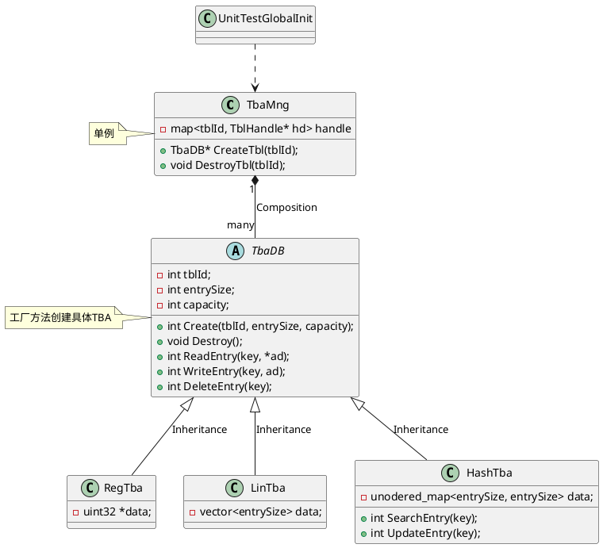

# UML工具

PlantUML和Mermaid都支持以“代码”的方式绘制UML图，含类图、时序图、状态图等。两者语法不完全相同。  
- 前者尚未在github上支持嵌入，需引用外链；但其图形标识好于后者，比如类有“C”标识。  
- 后者已支持github嵌入，但图形标识过于简单，尤其是类图标识主观感受较差。   
不强依赖github的话，建议还是使用plantUML。

### PlantUML

PlantUML在github上只能使用外链，没法直接使用内嵌语法(实际markdown支持内嵌，但github未支持？)。

github上的markdwon内嵌plantuml方法，使用PlantUML官网的Online Server存储UML，github中引用存储的外链。  
本地使用时，推荐VScode中安装PlantUML插件。

### Mermaid

Mermaid已支持github上直接使用markdown内嵌，如：

### 参考文档
1. [PlantUML官网](https://plantuml.com/zh/)：PlantUML语法介绍及Online Server
2. [PlantText](https://www.planttext.com/)：UML在线绘制
3. [Mermaid在线绘图](https://mermaid-js.github.io/mermaid-live-editor/)
4. [Mermaid官网](https://mermaid-js.github.io/mermaid/#/)

# Markdown内嵌(github)
 可内嵌HTML，但HTML表格内部（tr/td标签对中）无法再使用markdown解析；
 无法直接按语言段落内置plantuml或C语言，HUAWEI liteOS可以内置C语言的；可按链接方式链接plantUML server；
 无法显示同仓库下的图片：PC网络问题，代理网络可查看到图片。

# Git操作
- [git操作学习(动画版)](https://learngitbranching.js.org)
- [Git远程操作详解](https://www.ruanyifeng.com/blog/2014/06/git_remote.html)

# temp

